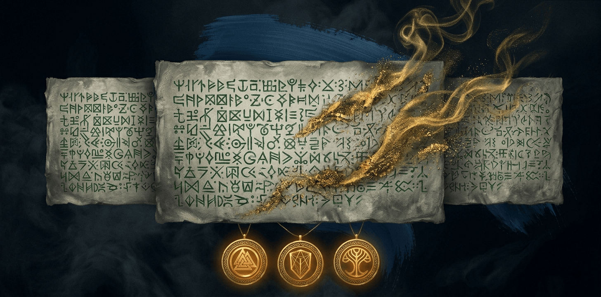

<p align="center">
  
</p>
<p align="center"><sub><em>The gold dust unmaking the parchment is the gommage. The three pendants below are pictos — signed, single-use grants.</em></sub></p>

<p align="center">
  <a href="https://github.com/Arakiss/gommage/actions/workflows/ci.yml"></a>
  <a href="https://github.com/Arakiss/gommage/releases"></a>
  <a href="LICENSE"></a>
  <a href="rust-toolchain.toml"></a>
  <a href="tests/determinism/"></a>
</p>

# gommage

> _« ce qui n'a pas lieu d'être, s'efface. »_

**A deterministic policy and audit layer for AI coding agent tool calls.**

> **Development status: alpha.** Gommage is public, installable, and being tested end-to-end, but it is under intensive development and the operator experience is still changing quickly. Expect breaking CLI/config changes, rough installation edges, and policy/mapping gaps until the project reaches a beta line. Use it first on non-critical repositories, keep your agent's native sandbox/permission layer enabled, and review generated policies before trusting them.

Gommage is one component in an **AI agent harness engineering** stack: the layer
that turns observed tool calls into deterministic, reviewable permission
decisions. It supports **Claude Code** and **OpenAI Codex CLI** today via their
`PreToolUse` hooks. It sits between the agent and the operation the agent wants
to perform, consults declarative YAML policy, and emits `allow` / `deny` /
`ask`, similar to how Kubernetes admission controllers or OPA sit in front of a
cluster API.

Gommage is **not a sandbox** and does not mediate execution. It decides, audits, and optionally requires a signed grant (picto) to proceed. For OS-level confinement, stack it under AppArmor / SELinux / `seccomp-bpf` / macOS Seatbelt / Codex's own `--sandbox` modes. See [`THREAT_MODEL.md`](THREAT_MODEL.md) for what that split means in practice.

Within its scope, the decision is **deterministic**: same `(tool_call, policy)` pair → same decision, every time, in forward order, in shuffled order, on every OS. No classifier, no Bayesian prior over the transcript, no mystery denies halfway through a task. CI enforces that property with a determinism regression suite that runs 10 times per build.

## Where it fits

A serious agent harness has multiple layers:

1. **OS confinement**: sandboxing, AppArmor, SELinux, `seccomp-bpf`, macOS
   Seatbelt, containers, and read/write boundaries.
2. **Agent-native permissions**: the sandbox and approval controls built into
   Claude Code, Codex, Cursor, or any other host.
3. **Policy decision gateway**: the `PreToolUse` interception point where
   Gommage can make a deterministic decision from the tool call and local
   policy.
4. **Break-glass grants**: signed, bounded approvals for exceptional actions.
5. **Audit and governance**: signed logs, policy hashes, CI, release signing,
   reviewable policy packs, and reproducible checks.

Gommage owns layer 3 and part of layers 4-5. It does not try to own the whole
stack. That framing matters: the project is useful because it composes with
native agent controls and OS confinement instead of pretending a hook is a
sandbox.

## Why

Agent-native permission layers are valuable, but they are usually difficult to
review, reproduce, or audit outside the agent. Teams and long-running solo
operators need permission behavior that can be versioned in a repo, explained
after the fact, and repeated across machines without hidden transcript state.

Gommage takes a narrow stance:

- **Deterministic, and we define what that means.** The evaluator reads exactly `(capabilities, policy)` and nothing else — no clock, no env, no CWD, no transcript, no filesystem state. Regex matching on tool inputs and glob matching on capability patterns are part of the deterministic transform; they are not heuristics. What Gommage does NOT do: classify, score, infer intent, or accumulate state across decisions. See [`THREAT_MODEL.md` §3](THREAT_MODEL.md#3-canonical-decision-input) for the exact contract.
- **Declarative.** Policies are YAML in `~/.gommage/policy.d/`. Version them, review them in PRs, `cat` them to understand why something got denied.
- **Capability-first.** Tool calls are mapped to capabilities (`git.push:main`, `fs.write:**/node_modules/**`, `net.out:api.stripe.com`). Policies match on capabilities, not on command strings.
- **Break-glass is real.** _Pictos_ (signed, TTL'd, usage-bounded grants) are first-class citizens of the policy. If a picto matches, it passes — no secret layer vetoing from above. The only override is a hardcoded, documented, finite hard-stop set.
- **Signed audit, verifiable offline.** Every decision is one line in an append-only JSONL log, ed25519-signed per line. Kill the daemon mid-write and at most the last line is corrupt; everything prior stays independently verifiable with `gommage audit-verify`.
- **Out-of-band approval.** `ask` decisions escalate to a human channel (TUI, webhook, push) — never back to the transcript. Keeps the agent and the approver on different wires.

## Status

**Current public release channel: alpha (`gommage-cli-v*`).** Usable with **Claude Code** (all supported tool types through the bundled mappers) and **OpenAI Codex CLI** (Bash tool only; Codex's `PreToolUse` hook is currently Bash-scoped upstream, tracked at [openai/codex#16732](https://github.com/openai/codex/issues/16732)). This is not production-ready yet; the next iterations are focused on launch-readiness smoke tests, policy regression fixtures, crates.io publishing gates, policy import fidelity, mapper coverage, and clearer harness-stack integrations. See [ROADMAP](#roadmap).

The alpha distribution has two install surfaces:

- **Runtime binaries**: `gommage`, `gommage-daemon`, and `gommage-mcp`, installed through the verified GitHub Release installer.
- **Agent skill**: [`skills/gommage`](skills/gommage), installed into Codex or Claude Code so future agent sessions know how to install, verify, troubleshoot, and operate Gommage correctly.

## Positioning

Gommage is an **opt-in complement** to whatever permission layer your agent ships with. Run both: keep native sandboxing and approvals enabled, then let Gommage handle the decisions you want to own as code. If the agent's native layer blocks something before the hook fires, Gommage cannot override that; if the hook observes the call, Gommage can make the local policy decision and audit it.

## Versioning and changelog

Gommage follows **Semantic Versioning**, with pre-1.0 rules applied strictly:

- Breaking changes to `gommage-core` public API, audit log schema, daemon IPC, CLI flags, policy input schema, or bundled stdlib decision behavior require a **minor** bump while the project is alpha.
- Compatible fixes and internal hardening use **patch** bumps.
- Release notes are generated through **release-please** from Conventional Commits; do not tag releases manually.
- Repo-level changes are tracked in [`CHANGELOG.md`](CHANGELOG.md); crate-level changes live in `crates/*/CHANGELOG.md`.

The beta bar is not "more features". It is stable install, stable hook wiring,
stable docs, crates.io publishing, healthy changelogs, and a green determinism
matrix with no known red workflows. The concrete launch gate is tracked in
[`docs/beta-readiness.md`](docs/beta-readiness.md).

## Install

Install the binaries first. Add `--with-skill` when you want the installer to
also install the Gommage agent skill for Codex, Claude Code, or both.

```sh
# macOS / Linux — alpha one-liner
# Requires cosign for Sigstore release verification.
# The installer resolves the latest gommage-cli binary release.
# Interactive terminals may be prompted for agent-skill installation.
# Use --no-prompt for scripted installs that must never ask questions.
curl --proto '=https' --tlsv1.2 -sSf \
  https://raw.githubusercontent.com/Arakiss/gommage/main/scripts/install.sh | sh

# Install binaries plus the agent skill for Codex and Claude Code.
curl --proto '=https' --tlsv1.2 -sSf \
  https://raw.githubusercontent.com/Arakiss/gommage/main/scripts/install.sh \
  | sh -s -- --with-skill --skill-agent codex --skill-agent claude

# Update only the agent skill, without reinstalling binaries.
curl --proto '=https' --tlsv1.2 -sSf \
  https://raw.githubusercontent.com/Arakiss/gommage/main/scripts/install.sh \
  | sh -s -- --skill-only --skill-agent codex --skill-agent claude

# Pin a specific alpha release or install elsewhere.
curl --proto '=https' --tlsv1.2 -sSf \
  https://raw.githubusercontent.com/Arakiss/gommage/main/scripts/install.sh \
  | sh -s -- --version gommage-cli-vX.Y.Z-alpha.N --bin-dir "$HOME/.local/bin"

# Private repo installs may pass a GitHub token for release downloads.
curl --proto '=https' --tlsv1.2 -sSf \
  https://raw.githubusercontent.com/Arakiss/gommage/main/scripts/install.sh \
  | GOMMAGE_GITHUB_TOKEN="$(gh auth token)" sh

# From source (today)
cargo install --path crates/gommage-cli --force
cargo install --path crates/gommage-daemon --force
cargo install --path crates/gommage-mcp --force
```

`cargo install gommage-cli` is **not supported yet**: the crates are not on
crates.io while the project is alpha. See
[`docs/publishing.md`](docs/publishing.md) for the current publish gate.

## Agent skill

This repository ships an Agent Skills-compatible skill at
[`skills/gommage`](skills/gommage). This is part of the product surface: it
teaches agents the correct Gommage install path, alpha caveats, daemon setup,
`doctor` checks, policy operations, publishing caveats, and release
verification flow.

Installer-managed skill targets:

- Codex: `${CODEX_HOME:-$HOME/.codex}/skills/gommage`
- Claude Code: `${CLAUDE_HOME:-$HOME/.claude}/skills/gommage`

Local install from a checkout:

```sh
sh scripts/install.sh --skill-only --skill-agent codex --skill-agent claude
```

Restart Codex or Claude Code after installing a new skill so the host discovers
it. Agent-facing quick install command:

```sh
curl --proto '=https' --tlsv1.2 -sSf \
  https://raw.githubusercontent.com/Arakiss/gommage/main/scripts/install.sh \
  | sh -s -- --skill-only --skill-agent codex --skill-agent claude --no-prompt
```

## For agents

Agents should use JSON surfaces and ignore decorative output. Do not parse
`gommage mascot`, `gommage logo`, or human forensic output. The beta-readiness
checklist lives in [`docs/beta-readiness.md`](docs/beta-readiness.md).

Install or update only the skill before operating the project:

```sh
curl --proto '=https' --tlsv1.2 -sSf \
  https://raw.githubusercontent.com/Arakiss/gommage/main/scripts/install.sh \
  | sh -s -- \
      --skill-only \
      --skill-agent codex \
      --skill-agent claude \
      --no-prompt
```

Primary setup and readiness commands:

```sh
gommage quickstart --agent claude --daemon --self-test
gommage quickstart --agent codex --daemon --self-test
gommage verify --json
gommage verify --json --policy-test examples/policy-fixtures.yaml
gommage agent status claude --json
gommage agent status codex --json
```

Debug the mapper with a real hook payload:

```sh
cat <<'JSON' | gommage map --json --hook
{
  "hook_event_name": "PreToolUse",
  "tool_name": "Bash",
  "tool_input": {
    "command": "git push --force origin main"
  }
}
JSON
```

Create and run policy regression fixtures:

```sh
gommage policy schema > gommage-policy-fixture.schema.json

cat <<'JSON' | gommage policy snapshot --name main_push_requires_picto
{
  "tool": "Bash",
  "input": {
    "command": "git push origin main"
  }
}
JSON

gommage policy test examples/policy-fixtures.yaml --json
```

Recovery and uninstall commands:

```sh
# Remove only host-agent hook wiring. Use --restore-backup when a quickstart
# backup is the safest recovery source.
gommage agent uninstall claude --restore-backup
gommage agent uninstall codex --restore-backup

# Inspect every removal before touching the system.
gommage uninstall --all --dry-run

# Remove selected surfaces without deleting ~/.gommage.
gommage uninstall --agent all --skills --binaries

# Destructive home removal requires explicit confirmation.
gommage uninstall --purge-home --yes
```

`GOMMAGE_BYPASS=1` is a hook-adapter break-glass for host environments that can
set hook process env vars. It makes `gommage-mcp` return `allow` without
opening `~/.gommage`, which is useful only for emergency recovery of a broken
hook path.

Stable automation contracts:

| Surface | Use it for |
|---|---|
| `verify --json` | Default readiness gate for installers, CI, and agents. |
| `doctor --json` | Lower-level runtime and install diagnostics. |
| `agent status --json` | Claude/Codex hook wiring and native permission import state. |
| `map --json` | Capability mapper debugging without policy evaluation or audit writes. |
| `smoke --json` | Built-in semantic post-install checks. |
| `policy test --json` | Project-owned policy regression fixtures. |
| `audit-verify --explain` | Signed audit verification JSON for automation. |
| `agent uninstall` / `uninstall --dry-run` | Reversible cleanup and recovery. |

The command contract above is checked by CI:

```sh
sh scripts/check-agent-command-contracts.sh
```

Human presentation output is intentionally not part of the automation contract.
Use `gommage audit-verify --explain --format human` only for manual forensic
review.

## Quickstart

```sh
# One-command setup for Claude Code:
# - initializes ~/.gommage
# - installs bundled policies + capability mappers
# - imports supported Claude permissions.deny and permissions.allow entries into policy.d/
# - installs the Claude PreToolUse hook with backups
# - installs and starts the user-level daemon service
# - runs the readiness gate after setup (`--self-test` is default; explicit here for scripts)
gommage quickstart --agent claude --daemon --self-test

# Scriptable verification. `warn` is expected before the first audit entry
# and `fail` means setup needs attention.
gommage doctor --json

# Semantic verification. This should pass before trusting the harness.
gommage smoke --json

# Optional project regression fixtures. Keep these in the repo and run in CI.
gommage policy test examples/policy-fixtures.yaml --json

# Optional schema export for editors, agents, and fixture generators.
gommage policy schema > gommage-policy-fixture.schema.json

# Inspect raw mapper output before writing or reviewing a rule.
echo '{"hook_event_name":"PreToolUse","tool_name":"Bash","tool_input":{"command":"git push --force origin main"}}' \
  | gommage map --json --hook

# Generate the first fixture from an observed tool call.
echo '{"tool":"Bash","input":{"command":"git push origin main"}}' \
  | gommage policy snapshot --name main_push_requires_picto \
  > examples/policy-fixtures.yaml

# One readiness gate for scripts, CI, and agent skills.
gommage verify --json --policy-test examples/policy-fixtures.yaml

# Start an expedition (a.k.a. task context)
gommage expedition start "refactor-auth-middleware"

# CI or image builds can generate service files without starting them.
gommage quickstart --agent claude --daemon-no-start --self-test

# Add Codex too. Codex hooks are Bash-scoped, so keep Codex sandbox enabled.
gommage agent install codex

# Diagnose the local installation
gommage verify

# Grant a one-shot picto for pushing to main
gommage grant \
  --scope "git.push:main" \
  --uses 1 \
  --ttl 10m \
  --reason "hotfix for INC-2461"

# Watch decisions live
gommage tail

# Explain a past decision
gommage explain <audit-id>

# Close the expedition (resets the canvas)
gommage expedition end

# Remove Gommage-managed host integrations when testing alpha builds.
gommage uninstall --all --dry-run
```

## Backups And Rollback

Gommage backs up files before replacing user-owned state. Agent configs, Codex
hook/config files, generated policy imports, and daemon service files are copied
next to the original as `<name>.gommage-bak-<timestamp>`. The installer also
backs up existing `gommage`, `gommage-daemon`, `gommage-mcp`, and skill files
before replacing them when the content differs. Unchanged files are left as-is.

Use these recovery paths before manual cleanup:

```sh
gommage agent uninstall claude --restore-backup
gommage agent uninstall codex --restore-backup
gommage uninstall --all --dry-run
```

`gommage uninstall --purge-home` requires `--yes` because `~/.gommage` contains
the daemon key, audit log, policy set, and local capability mappers.

## Diagnostics

Use `gommage verify` / `gommage verify --json` as the default readiness gate for installers, skills, CI smoke tests, and agent setup scripts. It runs `doctor`, `smoke`, and any repeated `--policy-test <file>` fixtures in one report. On a fresh machine it includes a top-level hint to run `gommage init` or `gommage quickstart`, and skips smoke when doctor already failed so the first error is the root cause. Use `gommage doctor` for lower-level installation checks, `gommage map --json` to inspect raw capability mapper output before writing policy, `--hook` on `map`, `decide`, or `policy snapshot` when stdin is a real PreToolUse payload, `gommage smoke --json` after policy installation to verify active mapper + policy semantics end to end, `gommage policy schema` to export the fixture contract, and `gommage policy test <file> --json` for repository-owned policy regression fixtures. The doctor JSON report has a top-level `status`:

- `ok`: all checks passed.
- `warn`: operable, but something is not running or has not happened yet, commonly no audit log before the first decision or no daemon socket because the hook will use the audited fallback.
- `fail`: non-zero exit; missing home, missing key, broken policy/capability mapper, unreadable expedition state, or unverifiable audit log.

Details are documented in [`docs/diagnostics.md`](docs/diagnostics.md).

## Architecture

```
┌──────────┐     tool call     ┌─────────────────────┐
│  Agent   │ ────────────────► │  gommage daemon     │
│          │                   │                     │
│ Claude   │ ◄─── decision ─── │  • Capability mapper│
│ Code     │                   │  • Policy evaluator │
│ Cursor…  │                   │  • Picto store      │
└──────────┘                   │  • Audit writer     │
                               └──────────┬──────────┘
                                          │
                                          ▼
                               ┌─────────────────────┐
                               │ ~/.gommage/         │
                               │  ├─ policy.d/*.yaml │
                               │  ├─ capabilities.d/ │
                               │  ├─ pictos.sqlite   │
                               │  ├─ audit.log       │
                               │  └─ key.ed25519     │
                               └─────────────────────┘
```

Full details in [`docs/architecture.md`](docs/architecture.md).

## Vocabulary

Borrowed from _Expedition 33_ (Sandfall Interactive, 2025) — functional, not ornamental:

| Term | Meaning |
|---|---|
| **Picto** | A signed grant with scope + TTL + max_uses. Gives an agent a temporary capability. |
| **Gommaged** | Verb. "Your tool call got gommaged" = denied by policy. |
| **Canvas** | The active set of policies governing a task. |
| **Expedition** | An atomic task/session. `gommage expedition start/end`. |

## Policy example

```yaml
# ~/.gommage/policy.d/10-defaults.yaml

- name: no-writes-to-build-artifacts
  decision: gommage
  match:
    any_capability:
      - "fs.write:**/node_modules/**"
      - "fs.write:**/.next/**"
      - "fs.write:**/.git/**"
  reason: "build artifacts are not edit targets"

- name: gate-main-push
  decision: ask_picto
  required_scope: "git.push:main"
  match:
    any_capability:
      - "git.push:refs/heads/main"
      - "git.push:refs/heads/master"
  reason: "pushes to main require a signed picto"

- name: allow-project-reads
  decision: allow
  match:
    all_capability:
      - "fs.read:${EXPEDITION_ROOT}/**"
```

Full cookbook in [`docs/policy-cookbook.md`](docs/policy-cookbook.md).

## Policy regression fixtures

Built-in `gommage smoke --json` proves the installed stdlib. Project fixtures
prove your own policy intent:

```yaml
version: 1
cases:
  - name: main_push_requires_picto
    tool: Bash
    input:
      command: git push origin main
    expect:
      decision: ask_picto
      required_scope: git.push:main
      matched_rule: gate-main-push
```

Run fixtures with:

```sh
gommage policy schema > gommage-policy-fixture.schema.json
gommage policy test examples/policy-fixtures.yaml --json
```

Each case reports the tool call, canonical `input_hash`, emitted capabilities,
matched rule, expected decision, actual decision, and mismatch errors. The
command exits non-zero when any case fails. The schema export is the stable
fixture contract for agents, editors, and CI fixture generators.

## Determinism guarantee

Gommage ships a deterministic fixture corpus with an expected decision oracle, in-order and shuffled. CI runs the sweep repeatedly across OS and locale combinations; if any decision flips based on ordering, the build fails. See [`tests/determinism/`](tests/determinism/).

## Roadmap

See [`docs/beta-readiness.md`](docs/beta-readiness.md) for the evidence
required before public beta or launch announcements.

**Current alpha line** — signed release-installer line
- Daemon + CLI + PreToolUse hook adapter
- Supported agents: **Claude Code** (all tool types), **OpenAI Codex CLI** (Bash tool only — limited by Codex's current hook surface)
- YAML policy + capability mappers for Bash, filesystem tools, Grep, WebFetch, WebSearch, MCP tools, git, cloud CLIs, package managers, Vercel, Bun, and Docker
- Pictos (signed, TTL, usage-bounded)
- Append-only signed audit log
- Hardcoded hard-stop set
- Repository-distributed agent skill for Gommage setup and operation
- Built-in semantic smoke checks and project-owned policy regression fixtures
- Capability mapping inspector for policy-authoring and mapper-debugging loops
- Packaged `gommage-stdlib` crate assets for future crates.io support
- Sigstore-signed binary release artifacts + installer verification
- Determinism-critical deps pinned with `=x.y.z`, `cargo-deny` + `cargo-semver-checks` + conventional-commits in CI, release-please for automated versioning

**v1.0** — hackable by others
- crates.io publishing for Rust-native `cargo install gommage-cli`
- Rego policies via `regorus`
- TUI dashboard (`gommage watch`) with live approvals
- Broader Codex coverage once upstream `PreToolUse` widens past Bash (openai/codex#16732)
- Cursor integration (Cursor has hooks but they run _after_ the native permission layer — needs a different wiring path; evaluated for v1.0)
- Generic MCP server mode for agents without a PreToolUse concept
- Community policy packs in `gommage-policies/`
- Webhook out-of-band

**Not planned** — either no hook API or known permission-bypass bugs in the hook layer: Aider, Zed, Continue, Cline. Revisited when upstream matures.

**v1.x** — scale
- Push approvals (ntfy, Slack native)
- Prometheus metrics endpoint
- Team-shared picto store (encrypted on S3)
- Policy inheritance (org → project → user)

## Not in scope

Gommage is a permission harness layer, not a complete security product:

- **Not an OS permission system.** AppArmor / SELinux operate below it; they are complementary.
- **Does not defend the agent binary itself.** If Claude Code is compromised at binary level, Gommage cannot help.
- **Not a secrets manager.** Use Vault / 1Password / sops; Gommage _protects_ them, doesn't store them.
- **Not a network proxy.** Use `mitmproxy` if you need TLS inspection.
- **Not generic policy-as-code.** OPA covers that. Gommage is optimized for the narrow case "AI agent decides to exec X".

See [`THREAT_MODEL.md`](THREAT_MODEL.md) for the full statement.

## Contributing

See [`CONTRIBUTING.md`](CONTRIBUTING.md).

## Acknowledgements — a tribute to Expedition 33

Gommage borrows its vocabulary — _gommage_, _picto_, _canvas_, _expedition_, and _Gestral_ — from **[Clair Obscur: Expedition 33](https://expedition33.com/)**, the 2025 game by [Sandfall Interactive](https://www.sandfall.co/). The game's central act — the _gommage_, where the Paintress writes a number on her canvas and the marked are erased — gave this project the precise metaphor it needed for what a policy engine does to tool calls that have no business running. The picto naming and the "canvas" naming of the active policy set are a fan's homage to the world they built.

This project is not affiliated with, endorsed by, or sponsored by **Sandfall Interactive**, **Kepler Interactive**, or any of their partners. _Clair Obscur: Expedition 33_, its characters, logos, artwork, and music remain the sole property of their respective rights holders. The usage of shared terms in this codebase is purely tributary and made with respect for the creators.

If any rights holder would prefer different naming or framing, please [open an issue](https://github.com/Arakiss/gommage/issues) — we will adjust gladly.

If you have not played _Expedition 33_ yet, stop reading this README and go play it.

## License

MIT. See [`LICENSE`](LICENSE).
