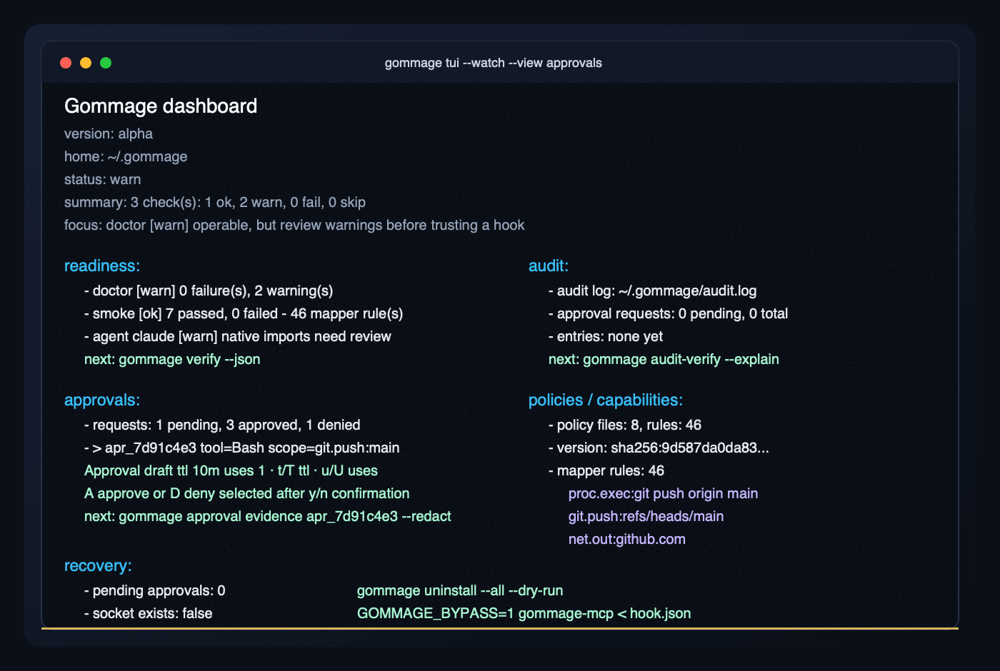

<p align="center">
  
</p>
<p align="center"><sub><em>The gold dust unmaking the parchment is the gommage. The three pendants below are pictos — signed, single-use grants.</em></sub></p>

<p align="center">
  <a href="https://github.com/Arakiss/gommage/actions/workflows/ci.yml"></a>
  <a href="https://github.com/Arakiss/gommage/releases"></a>
  <a href="LICENSE"></a>
  <a href="rust-toolchain.toml"></a>
  <a href="tests/determinism/"></a>
</p>

# gommage

> _« ce qui n'a pas lieu d'être, s'efface. »_

**A deterministic policy and audit layer for AI coding agent tool calls.**

> **Development status: beta.** Gommage is public, installable, and tested
> end-to-end, but it is still pre-1.0 software. Expect some CLI/config changes
> and policy/mapping gaps while the operator workflow hardens. Use it first on
> non-critical repositories, keep your agent's native sandbox/permission layer
> enabled, and review generated policies before trusting them.
>
> The first beta is defined by evidence, not by optimism. Read
> [`docs/beta-contract.md`](docs/beta-contract.md) for the exact beta promise
> and [`docs/beta-readiness.md`](docs/beta-readiness.md) for the launch gate.
> To see the intended workflow without touching your real agent config, run
> `sh scripts/launch-demo.sh` from a checkout.

> **AI agent bootstrap:** before diagnosing, installing, or changing Gommage,
> install or read [`skills/gommage`](skills/gommage). That skill is the
> canonical agent-facing operating guide. On a local machine, start with
> `gommage harness diagnose --json` or `gommage harness explain` so the agent
> reads the effective host setup instead of inferring it from generic docs.

Gommage is one component in an **AI agent harness engineering** stack: the layer
that turns observed tool calls into deterministic, reviewable permission
decisions. It supports **Claude Code** and **OpenAI Codex CLI** today via their
`PreToolUse` hooks. It sits between the agent and the operation the agent wants
to perform, consults declarative YAML policy, and emits `allow` / `deny` /
`ask`, similar to how Kubernetes admission controllers or OPA sit in front of a
cluster API.

Gommage is **not a sandbox** and does not mediate execution. It decides, audits, and optionally requires a signed grant (picto) to proceed. For OS-level confinement, stack it under AppArmor / SELinux / `seccomp-bpf` / macOS Seatbelt / Codex's own `--sandbox` modes. See [`THREAT_MODEL.md`](THREAT_MODEL.md) for what that split means in practice.

Within its scope, the decision is **deterministic**: same `(tool_call, policy)` pair → same decision, every time, in forward order, in shuffled order, on every OS. No classifier, no Bayesian prior over the transcript, no mystery denies halfway through a task. CI enforces that property with a determinism regression suite (107 fixtures, run forward and shuffled on every build).

## See it — a gate you can't slip by command shape

Most tool-call guardrails key on the command string. Wrap the command and the
specialized rule no longer matches. Gommage's Bash mapper parses shell structure
and runs every policy rule **per segment**, so the same gate fires however the
command is dressed up:

| the agent runs… | a command-string gate | gommage |
|---|---|---|
| `git push origin main` | gated | **ask** · picto `git.push:main` |
| `cd /repo && git push origin main` | missed | **ask** |
| `env X=1 sudo git push origin main` | missed | **ask** |
| `/usr/bin/git push origin main` | missed | **ask** |
| `timeout 30 git push origin main` | missed | **ask** |
| `bash -c 'git push origin main'` | missed | **ask** |
| `echo $(git push origin main)` | missed | **ask** |
| `echo 'git push origin main'` (quoted data) | — | **not matched** · it's a string, not a command |

Those seven evasion shapes are committed fixtures
(`tests/determinism/fixtures/shell_git_push_main_{abspath,bash_c,compound,env_sudo,leading_true,substitution,timeout}.json`,
all resolving to `ask_picto` scope `git.push:main`); the quoted-data row is a
guard fixture proving it does **not** false-positive on data. The same
shell-awareness routes `cat`, `cp`, `tee`, and `>`/`>>` redirects through the
filesystem gates — a read or write done from Bash is decided like the agent's
Read/Write tool, not waved through because a shell produced it. Source:
[`crates/gommage-core/src/shell.rs`](crates/gommage-core/src/shell.rs) and
[`mapper.rs`](crates/gommage-core/src/mapper.rs).

The coverage is honest, not total. A few wrapper forms — `git -C <dir>`,
`eval`/`xargs`, the refspec `HEAD:main` — currently **deny fail-closed** (a
generic deny) instead of resolving to the precise gate scope; they never leak to
`allow`. And an operator policy that grants a broad `proc.exec:*` allow re-opens
shape-based bypass, so keep allows narrow. See
[`docs/THREAT_MODEL.md`](docs/THREAT_MODEL.md).

## What it gates

The bundled stdlib decides these out of the box. Anything unmatched is
**fail-closed** (denied) unless your policy allows it. `ask` needs a signed
[picto](#vocabulary) to proceed; `deny` cannot be satisfied by a picto.

| surface | examples | decision |
|---|---|---|
| Git | push to `main`/`release/*`, force-push, `reset --hard`, `config url.*.insteadOf`/`core.hooksPath` | ask |
| Filesystem (write) | dotfile/credential dirs, build artifacts & `.git`, shell-rc (`~/.zshrc`…), `..` traversal | deny |
| Filesystem | reads/writes outside the expedition root | fail-closed deny |
| Supply chain | `npm` / `cargo` / `twine` **publish** | ask |
| Persistence | `crontab -e`, `launchctl load`, `systemctl --system enable` | ask |
| Host devices | `> /dev/sd*`, `dd of=/dev/…`, `tee /dev/sd*` | deny |
| Containers | `docker run --privileged`, host-path / docker.sock mounts | ask |
| Egress | `scp`/`rsync` to a remote, `ssh` remote-command, `curl`/`wget` upload·POST | ask |
| Permissions | `chmod -R` or world-writable mode, `chown -R` or to root | ask |
| Code injection | `LD_PRELOAD=` / `DYLD_INSERT_LIBRARIES=` command prefixes | deny |
| Package / cloud | `bun`/`npm install` (allow), Vercel prod deploy, kubectl/terraform/aws/gh mutations | allow · ask |

Routine work stays out of the way: `npm install`, `chmod +x script.sh`,
`git config user.name`, a plain `curl https://…` GET, `kill 1234`, and a
project-local build all pass. Capability mappers live in
[`crates/gommage-stdlib/capabilities/`](crates/gommage-stdlib/capabilities/),
gates in [`crates/gommage-stdlib/policies/`](crates/gommage-stdlib/policies/).

Ahead of all policy sits a small set of **compiled hard-stops** — denied
unconditionally, before policy, pictos, or `GOMMAGE_BYPASS`: `rm -rf /` and
`/*`, `sudo rm -rf …`, `dd if=… of=/dev/…`, `shred /dev/…`, `chmod -R … /`,
the classic fork bomb, plus shell-semantic scanners for `rm -rf <absolute>`,
`dd of=/dev/…`, and `xargs rm -rf` so wrapping doesn't help. These are code, not policy
([`crates/gommage-core/src/hardstop.rs`](crates/gommage-core/src/hardstop.rs));
the policy-level denies above (device writes, injection, …) are separate and
satisfiable only by editing policy.

## Why not just…?

- **…the agent's built-in permissions?** Keep them on — gommage runs *with*
  them, not instead. But they're opaque, per-agent, and live in transcript/UI
  state you can't version, diff in a PR, or replay on another machine. gommage is
  YAML in a repo plus a signed audit trail.
- **…a shell hook with an allowlist regex?** That string/regex match is dodged
  by command shape (`cd x && …`, `$(…)`, `env … sudo …`) — the exact problem the
  per-segment mapper above exists to close.
- **…OPA or a general policy engine?** You could, but you'd build the tool-call
  mappers, the shell parser, the signed-grant (picto) model, and the offline-
  verifiable audit yourself. gommage is the narrow, batteries-included version
  for this one job, deterministic by construction.
- **…an OS sandbox (seccomp / AppArmor / Seatbelt)?** Different layer — stack it
  *under* gommage. A sandbox confines what a process may do; gommage decides and
  audits whether the agent should make the call at all, with a human-approvable
  grant in the middle.

## Where it fits

A serious agent harness has multiple layers:

1. **OS confinement**: sandboxing, AppArmor, SELinux, `seccomp-bpf`, macOS
   Seatbelt, containers, and read/write boundaries.
2. **Agent-native permissions**: the sandbox and approval controls built into
   Claude Code, Codex, Cursor, or any other host.
3. **Policy decision gateway**: the `PreToolUse` interception point where
   Gommage can make a deterministic decision from the tool call and local
   policy.
4. **Break-glass grants**: signed, bounded approvals for exceptional actions.
5. **Audit and governance**: signed logs, policy hashes, CI, release signing,
   reviewable policy packs, and reproducible checks.

Gommage owns layer 3 and part of layers 4-5. It does not try to own the whole
stack. That framing matters: the project is useful because it composes with
native agent controls and OS confinement instead of pretending a hook is a
sandbox.

The design boundary is expanded in
[Reference monitors for coding agents](https://www.petruarakiss.com/blog/reference-monitors-for-coding-agents):
why a coding-agent harness needs a small, always-on decision point for tool
calls instead of transcript-only permissions.

## Why

Agent-native permission layers are valuable, but they are usually difficult to
review, reproduce, or audit outside the agent. Teams and long-running solo
operators need permission behavior that can be versioned in a repo, explained
after the fact, and repeated across machines without hidden transcript state.

Gommage takes a narrow stance:

- **Deterministic, and we define what that means.** The evaluator reads exactly `(capabilities, policy)` and nothing else — no clock, no env, no CWD, no transcript, no filesystem state. Regex matching on tool inputs and glob matching on capability patterns are part of the deterministic transform; they are not heuristics. What Gommage does NOT do: classify, score, infer intent, or accumulate state across decisions. See [`THREAT_MODEL.md` §3](THREAT_MODEL.md#3-canonical-decision-input) for the exact contract.
- **Declarative.** Policies are YAML in `~/.gommage/policy.d/`. Version them, review them in PRs, `cat` them to understand why something got denied.
- **Capability-first.** Tool calls are mapped to capabilities (`git.push:refs/heads/main`, `fs.write:**/.git/**`, `pkg.npm:publish`, `net.out.post`, `disk.device:write`). Policies match on capabilities, not on command strings — and the Bash mapper derives them from parsed shell segments, so the capability is the same whether the command is bare or wrapped. See [What it gates](#what-it-gates) for the full bundled set.
- **Break-glass is real.** _Pictos_ (signed, TTL'd, usage-bounded grants) are first-class citizens of the policy. If a picto matches, it passes — no secret layer vetoing from above. The only override is a hardcoded, documented, finite hard-stop set.
- **Signed audit, verifiable offline.** Every decision is one line in an append-only JSONL log, ed25519-signed per line. Kill the daemon mid-write and at most the last line is corrupt; everything prior stays independently verifiable with `gommage audit-verify`.
- **Out-of-band approval.** `ask` decisions escalate to a human channel (TUI, webhook, push) — never back to the transcript. Keeps the agent and the approver on different wires.

## Status

**Current public release channel: beta (`gommage-cli-v*-beta.*`).** Usable with
**Claude Code** (Bash, filesystem, search, web, and Claude-style MCP tool names
through the bundled mappers) and **OpenAI Codex CLI** (the current Gommage
quickstart installs a Codex `PreToolUse` matcher for Bash, `apply_patch`, and
Codex MCP tool names). Codex upstream still has hook-boundary details that
matter: not every shell path is intercepted yet, and WebSearch / other
non-shell, non-MCP tools remain outside Gommage's default Codex surface. This
is not production-ready; the next iterations are focused on launch-readiness
smoke tests, policy regression fixtures, crates.io publishing gates, policy
import fidelity, deeper host-smoke evidence, mapper coverage, and clearer
harness-stack integrations. See [ROADMAP](#roadmap).

**Windows is not supported.** The daemon is a Unix-domain-socket service
(`tokio::net::UnixListener`), so `gommage-daemon` does not build on Windows; a
non-Unix build fails fast with an explicit message. Named-pipe / TCP transport
is a post-1.0 item (roadmap v1.x). Use macOS or Linux today, or WSL2 on a
Windows host.

The prerelease distribution has two install surfaces:

- **Runtime binaries**: the verified GitHub Release archive contains
  `gommage`, `gommage-daemon`, and `gommage-mcp`, and the installer copies all
  three into the selected bin directory.
- **Agent skill**: [`skills/gommage`](skills/gommage), installed into Codex or Claude Code so future agent sessions know how to install, verify, troubleshoot, and operate Gommage correctly.
- **Operator dashboard**: `gommage tui`, a dependency-free terminal command
  center for humans with readiness, approvals, policies, audit, capabilities,
  recovery, onboarding, and local metrics views. Use `gommage tui --snapshot --view all` for
  issue reports and non-interactive shells, or
  `gommage tui --watch --watch-ticks 3` when a headless terminal should show
  live refreshes. Use `gommage tui --stream` for
  a compact decision/event feed backed by daemon IPC when the daemon is running,
  with signed audit-log fallback for CI and local captures. Snapshot and stream
  output include daemon reachability, active picto inventory, and local counters
  so a human can see whether the operator loop is alive. Interactive approvals
  can tune TTL/use-count presets before resolving pending requests, and still
  require an explicit confirmation keystroke before mutating state.

Only `gommage-cli-v*` is a user-facing product release. Older alpha history may
show per-crate GitHub Releases for internal workspace components such as
`gommage-mcp` or `gommage-daemon`; those are implementation components, not
separate products. Current release automation keeps GitHub Releases focused on
the installable product channel while crate versions may still differ inside
`gommage --version` for semver hygiene.

<p align="center">
  
</p>
<p align="center"><sub>Representative animated demo of <code>gommage tui</code>, <code>--snapshot</code>, and <code>--watch</code> operator views. Snapshot/watch output stays plain text for terminals, issue reports, and agent-readable diagnostics. Static fallback: <a href="docs/assets/tui-dashboard.svg">SVG</a>.</sub></p>

## Positioning

Gommage is an **opt-in complement** to whatever permission layer your agent ships with. Run both: keep native sandboxing and approvals enabled, then let Gommage handle the decisions you want to own as code. If the agent's native layer blocks something before the hook fires, Gommage cannot override that; if the hook observes the call, Gommage can make the local policy decision and audit it.

## Existing Setups And Migration

Gommage is not a "virgin machine only" tool, but mature harnesses deserve a
dry-run first. The default install posture is coexistence:

- `quickstart --agent claude` preserves unrelated Claude `PreToolUse` hook
  groups and appends the Gommage hook. Use `--replace-hooks` only when you
  intentionally want Gommage to own that hook surface.
- `quickstart --agent codex` writes the Gommage Codex hook and enables Codex
  hooks, but it does not rewrite Codex sandbox or approval policy.
- Changed host files are backed up next to the original as
  `<name>.gommage-bak-<timestamp>`.
- Supported Claude `permissions.deny` entries are imported into
  `05-claude-import.yaml`; supported `permissions.allow` entries, including
  broad rules such as `Bash`, are imported into `90-claude-allow-import.yaml`.
  That late allow layer preserves the user's existing Claude posture while
  earlier hard-stops, deny imports, and ask rules still win.

Existing shell hooks can run alongside Gommage. That is a valid defense-in-depth
posture, but it means the first layer to block determines what the agent sees.
If an existing hook blocks before Gommage, Gommage will not audit that decision.
If Gommage blocks or asks first, the agent receives the Gommage hook reason and
the signed audit log records the decision.

For mature dotfiles, use this order:

```sh
gommage harness diagnose --json
gommage quickstart --agent claude --daemon --dry-run --json
gommage quickstart --agent claude --daemon --dry-run --explain
gommage quickstart --agent codex --daemon --dry-run --json
gommage agent status claude --json
gommage agent status codex --json
gommage verify --json
gommage uninstall --all --dry-run
```

In the JSON plan, inspect `agent_integrations[].hook.strategy` and
`agent_integrations[].hook.existing_hook_groups`. The default strategy is
`append_preserving_unrelated`: unrelated hook groups are marked
`would_preserve`, stale Gommage-owned hook groups are marked
`would_remove_stale_gommage`, and `--replace-hooks` is the only mode that
removes unrelated hook groups.

If the dry-run shows a CLI or tool family that Gommage does not classify, do
not assume it is covered. Capture the mapper output with `gommage map --json`
or `gommage map --json --hook`, then add a capability mapper and policy fixture
before relying on it. See [`docs/existing-setups.md`](docs/existing-setups.md)
for the full migration and dual-agent guidance.

After a real quickstart, Gommage writes an agent-readable local summary into
`$GOMMAGE_HOME/AGENT_CONTEXT.md` and
`$GOMMAGE_HOME/integration-report.json`. These files describe the effective
install mode, preserved hooks, imported native permissions, coverage boundaries,
and next diagnostic commands for future Claude/Codex sessions.

## Versioning and changelog

Gommage follows **Semantic Versioning**, with pre-1.0 rules applied strictly:

- Breaking changes to `gommage-core` public API, audit log schema, daemon IPC, CLI flags, policy input schema, or bundled stdlib decision behavior require a **minor** bump while the project is pre-1.0.
- Compatible fixes and internal hardening use **patch** bumps.
- Release notes are generated through **release-please** from Conventional Commits; do not tag releases manually.
- Repo-level changes are tracked in [`CHANGELOG.md`](CHANGELOG.md); crate-level changes live in `crates/*/CHANGELOG.md`.

Because Gommage is pre-1.0, a minor (`0.x`) bump MAY contain breaking changes to
policy and capability semantics. Downstream crate consumers should pin exact
versions until 1.0 — see [`BREAKING_CHANGES.md`](BREAKING_CHANGES.md) for the
full policy.

Beta releases use `gommage-cli-vX.Y.Z-beta.N` tags and remain GitHub
prereleases until the project reaches a production-ready line. The presence of
`gommage beta check` means "run the beta gate"; it does not mean the host is
healthy until the command returns `pass` or an understood, documented `warn`.

The beta bar is not "more features". It is stable install, stable hook wiring,
stable docs, explicit crates.io status, healthy changelogs, and a green
determinism matrix with no known red workflows. The concrete launch gate is tracked in
[`docs/beta-readiness.md`](docs/beta-readiness.md); the claim boundary is
defined in [`docs/beta-contract.md`](docs/beta-contract.md); real host test
passes should follow [`docs/beta-test-loop.md`](docs/beta-test-loop.md).

For the shortest local proof path, run:

```sh
sh scripts/launch-demo.sh
```

That demo uses an isolated temporary home and captures quickstart dry-run,
`ask_picto`, one-use picto allow, hard-stop deny, signed audit verification,
`state.sqlite` rebuild/verify/stats, policy fixtures, beta check, and a TUI
snapshot.

## Install

Install the binaries first. Add `--with-skill` when you want the installer to
also install the Gommage agent skill for Codex, Claude Code, or both.
Installing the `gommage-mcp` binary does not automatically register an MCP
gateway for every MCP server on the host. New `quickstart` installs supported
agent hooks through the primary CLI command, `gommage hook --agent <host>`, so
Claude can keep `ask` decisions while Codex turns picto-required calls into
explicit denials. The MCP gateway is an optional compatibility bridge for a
deliberately wrapped stdio server:
`gommage-mcp --gateway --server-name <name> -- <stdio-mcp-server>`.

```sh
# macOS / Linux — beta one-liner
# Requires cosign for Sigstore release verification.
# The installer resolves the latest gommage-cli binary release.
# Interactive terminals may be prompted for agent-skill installation.
# Use --no-prompt for scripted installs that must never ask questions.
curl --proto '=https' --tlsv1.2 -sSf \
  https://raw.githubusercontent.com/Arakiss/gommage/main/scripts/install.sh | sh

# Install binaries plus the agent skill for Codex and Claude Code.
curl --proto '=https' --tlsv1.2 -sSf \
  https://raw.githubusercontent.com/Arakiss/gommage/main/scripts/install.sh \
  | sh -s -- --with-skill --skill-agent codex --skill-agent claude

# Update only the agent skill, without reinstalling binaries.
curl --proto '=https' --tlsv1.2 -sSf \
  https://raw.githubusercontent.com/Arakiss/gommage/main/scripts/install.sh \
  | sh -s -- --skill-only --skill-agent codex --skill-agent claude

# Pin a specific beta release or install elsewhere.
curl --proto '=https' --tlsv1.2 -sSf \
  https://raw.githubusercontent.com/Arakiss/gommage/main/scripts/install.sh \
  | sh -s -- --version gommage-cli-vX.Y.Z-beta.N --bin-dir "$HOME/.local/bin"

# Private repo installs may pass a GitHub token for release downloads.
curl --proto '=https' --tlsv1.2 -sSf \
  https://raw.githubusercontent.com/Arakiss/gommage/main/scripts/install.sh \
  | GOMMAGE_GITHUB_TOKEN="$(gh auth token)" sh

# From crates.io for Rust-native source builds.
cargo install gommage-cli --locked
cargo install gommage-daemon --locked
cargo install gommage-mcp --locked

# From a checkout.
cargo install --path crates/gommage-cli --force
cargo install --path crates/gommage-daemon --force
cargo install --path crates/gommage-mcp --force
```

The GitHub Release installer remains the recommended end-user path because it
installs all three binaries from signed, checksum-verified artifacts. The
crates.io packages are published for Rust-native users who prefer source builds
through `cargo install`; see [`docs/publishing.md`](docs/publishing.md) for the
current package status and release workflow.

## Update And Upgrade

Gommage uses `update` and `upgrade` as separate operator actions:

- `gommage update` checks for a newer installable release and does not mutate
  files.
- `gommage upgrade` runs the verified installer and changes the local
  installation.

```sh
# Check whether a newer platform release exists.
gommage update
gommage update --json

# Install the latest release, using the same Sigstore/SHA-256 verified path as
# the one-line installer.
gommage upgrade

# Preview the installer command without downloading or writing files.
gommage upgrade --dry-run

# Refresh only Codex/Claude Code skills when docs or agent guidance changed.
gommage upgrade --skill-only --skill-agent codex --skill-agent claude --no-prompt
```

See [`docs/updating.md`](docs/updating.md) for the full update vs upgrade
contract, including `--check`, `--force`, pinned versions, skill-only updates,
and when each command should be used.

## Agent skill

This repository ships an Agent Skills-compatible skill at
[`skills/gommage`](skills/gommage). This is part of the product surface: it
teaches agents the correct Gommage install path, beta caveats, daemon setup,
`doctor` checks, policy operations, publishing caveats, and release
verification flow.

Installer-managed skill targets:

- Codex: `${CODEX_HOME:-$HOME/.codex}/skills/gommage`
- Claude Code: `${CLAUDE_HOME:-$HOME/.claude}/skills/gommage`

Local install from a checkout:

```sh
sh scripts/install.sh --skill-only --skill-agent codex --skill-agent claude
```

Restart Codex or Claude Code after installing a new skill so the host discovers
it. Agent-facing quick install command:

```sh
curl --proto '=https' --tlsv1.2 -sSf \
  https://raw.githubusercontent.com/Arakiss/gommage/main/scripts/install.sh \
  | sh -s -- --skill-only --skill-agent codex --skill-agent claude --no-prompt
```

## For agents

Agents should use JSON surfaces and ignore decorative output. Do not parse
`gommage mascot`, `gommage logo`, or human forensic output. The beta-readiness
checklist lives in [`docs/beta-readiness.md`](docs/beta-readiness.md).
The canonical machine-readable command contract lives in
[`docs/agent-command-manifest.json`](docs/agent-command-manifest.json).
Host validation evidence lives in [`docs/host-smoke.md`](docs/host-smoke.md)
and `scripts/host-smoke.sh`. Release asset evidence is scriptable through
`gommage release verify`, `scripts/check-release-assets.sh`, and
`scripts/verify-release.sh`. The local launch demo is documented in
[`examples/launch-demo`](examples/launch-demo/) and runs with
`sh scripts/launch-demo.sh`.

Install or update only the skill before operating the project:

```sh
curl --proto '=https' --tlsv1.2 -sSf \
  https://raw.githubusercontent.com/Arakiss/gommage/main/scripts/install.sh \
  | sh -s -- \
      --skill-only \
      --skill-agent codex \
      --skill-agent claude \
      --no-prompt
```

Primary setup and readiness commands:

```sh
gommage harness diagnose --json
gommage harness explain --agent claude
gommage quickstart --agent claude --daemon --dry-run --json
gommage quickstart --agent claude --daemon --dry-run --explain
gommage quickstart --agent claude --daemon --self-test
gommage quickstart --agent codex --daemon --self-test
gommage beta check --json
gommage beta check --json --policy-test examples/policy-fixtures.yaml
gommage verify --json
gommage verify --json --policy-test examples/policy-fixtures.yaml
gommage report bundle --redact --output gommage-report.json
gommage agent status claude --json
gommage agent status codex --json
```

Debug the mapper with a real hook payload:

```sh
cat <<'JSON' | gommage map --json --hook
{
  "hook_event_name": "PreToolUse",
  "tool_name": "Bash",
  "tool_input": {
    "command": "git push --force origin main"
  }
}
JSON
```

Create and run policy regression fixtures:

```sh
gommage policy schema > gommage-policy-fixture.schema.json

cat <<'JSON' | gommage policy snapshot --name main_push_requires_picto
{
  "tool": "Bash",
  "input": {
    "command": "git push origin main"
  }
}
JSON

gommage policy test examples/policy-fixtures.yaml --json
```

Recovery and uninstall commands:

```sh
# Rewrite old or broken Gommage hook groups to the current scoped hook while
# preserving unrelated host hooks. Always inspect first on a real machine.
gommage repair agent claude --dry-run
gommage repair agent codex --dry-run

# Remove only host-agent hook wiring. Use --restore-backup when a quickstart
# backup is the safest recovery source.
gommage agent uninstall claude --restore-backup
gommage agent uninstall codex --restore-backup

# Inspect every removal before touching the system.
gommage uninstall --all --dry-run

# Remove selected surfaces without deleting ~/.gommage.
gommage uninstall --agent all --skills --binaries

# Destructive home removal requires explicit confirmation.
gommage uninstall --purge-home --yes

# Remove Gommage-created backup files only when you want a clean slate.
gommage uninstall --purge-backups
```

`GOMMAGE_BYPASS=1` is a hook-adapter break-glass for host environments that can
set hook process env vars. It is a policy bypass, not a superuser bypass:
valid hook payloads are still mapped through compiled capability rules, and
compiled hard-stops still return `deny`. When a usable Gommage home/key exists,
the bypass writes a signed `bypass_activated` audit event. If the hook payload
itself is malformed, bypass can still allow without opening `~/.gommage` for
emergency hook recovery.

Stable automation contracts:

| Surface | Use it for |
|---|---|
| `quickstart --dry-run --json` | Inspect planned setup mutations, backups, hook coexistence actions, imports, daemon service files, and self-test checks before touching a real home. |
| `quickstart --dry-run --explain` | Print the same setup posture in human/agent-readable language without writing files. |
| `harness diagnose --json` | Inspect host hooks, imported permission posture, coverage boundaries, and next commands without installing anything. |
| `harness explain` | Print the local setup context in Markdown for Claude/Codex sessions. |
| `harness write-context --dry-run` | Inspect the generated `AGENT_CONTEXT.md` and `integration-report.json` writes before refreshing local context files. |
| `beta check --json` | One host-level beta gate for agents and testers: doctor, smoke, agent status, optional policy fixtures, state-index readiness, dashboard availability, and next steps. |
| `verify --json` | Default readiness gate for installers, CI, and agents. |
| `report bundle --redact` | Support artifact for install or host-integration failures without exposing secrets. |
| `doctor --json` | Lower-level runtime and install diagnostics. |
| `agent status --json` | Claude/Codex hook wiring and native permission import state. |
| `posture --json` | Compare active local policy against bundled strict stdlib semantics and name relaxed/custom posture. |
| `session doctor --json` | Inspect live agent-like processes and whether their inferred Claude/Codex homes are Gommage-wired. |
| `managed status --json` | Inspect optional managed-mode readiness: daemon service/socket, permissions, hooks, and bypass environment. |
| `run codex --dry-run --json -- <task>` | Build a verified Codex launch plan with an explicit sandbox without executing Codex. |
| `repair agent <agent> --dry-run` | Inspect legacy/broken Gommage hook repair before mutating host config. |
| `map --json` | Capability mapper debugging without policy evaluation or audit writes. |
| `smoke --json` | Built-in semantic post-install checks. |
| `stats --json` | Audit, approval, friction, deny-loop, and watchlist telemetry from local logs. |
| `sandbox advise --json` | Advisory native sandbox bridge guidance for Codex, bwrap, macOS Seatbelt, and AppArmor. This is not enforcement. |
| `policy test --json` | Project-owned policy regression fixtures. |
| `policy layers --json` | Active policy layer order, per-layer rule counts, and effective policy version hash. |
| `policy lint --strict --json` | Strict authoring checks for duplicate names, exact-match shadowing, empty matches, empty patterns, and weak rule metadata. |
| `replay --audit <file> --policy <dir> --json` | Re-evaluate historical audit decisions against a candidate policy. |
| `policy diff --from <dir> --to <dir> --against <file> --json` | Compare two policy directories against the same historical audit decisions. |
| `policy suggest --audit <file> --json` | Generate advisory candidate rules and fixture drafts for audit decisions not covered by the active policy. |
| `explain <audit-id> --trace --json` | Audit-entry trace over current policy rule order, active decision, shadowed matches, and fixture-authoring hints. |
| `audit-verify --explain` | Signed audit verification JSON for automation. |
| `state rebuild --json` | Rebuild the local `state.sqlite` read-model from the signed `audit.log` ledger. |
| `state verify --json` | Check whether `state.sqlite` matches the current audit ledger. |
| `state stats --json` | Read fast local counters from `state.sqlite`; use `state rebuild` when stale. |
| `tui --watch --watch-ticks <n>` | Bounded plain-text operator refreshes for demos, CI artifacts, and headless issue reports. |
| `tui --stream --stream-ticks <n>` | Bounded live decision/event feed using daemon IPC when available, then current `state.sqlite`, then signed audit-log fallback, plus daemon health, active pictos, and local counters. |
| `tui --snapshot --view onboarding` | First-minute operator guide with safe setup, beta gate, report, and rollback commands. |
| `tui --snapshot --view metrics` | Human local metrics summary for daemon reachability, active pictos, decisions, approvals, webhook DLQ, and audit anomalies. |
| `approval list --json` | Pending out-of-band approval requests. Use `--status all` for history. |
| `approval show <id> --json` | One approval request, including scope, reason, rule, and input hash. |
| `approval approve <id> --json` | Resolve a request and emit the minted exact-scope picto, TTL, uses, scope, and next action for agents. |
| `approval deny-stale --older-than 24h --json` | Dry-run stale pending approval cleanup; add `--apply` to append denied resolutions. |
| `approval replay <id> --json` | Compare a stored approval request against the current policy. |
| `approval evidence <id> --redact` | Export request state, relevant signed audit lines, verification summary, and next commands. |
| `approval dlq --json` | Inspect dead-lettered approval webhook deliveries after bounded retries are exhausted. |
| `approval webhook --dry-run --json` | Render generic, Slack, or Discord payloads in `requests[].payload` without sending network traffic. |
| `approval callback --dry-run --json` | Verify a signed remote approval callback, timestamp, and request-bound nonce without mutating state. |
| `approval template --provider <name> --json` | Render generic, Slack, Discord, or ntfy notification payload templates. |
| `project init --dry-run --json` | Inspect project-local policy, fixture, and README starter files before creating them. |
| `agent uninstall` / `uninstall --dry-run` | Reversible cleanup and recovery. |

The manifest and command contract above are checked by CI:

```sh
sh scripts/check-agent-command-contracts.sh
```

Human presentation output is intentionally not part of the automation contract.
Agents may suggest `gommage tui --snapshot` or bounded `gommage tui --watch
--watch-ticks <n>` for human issue reports, but should continue to parse
`--json` commands. Use `gommage audit-verify --explain --format human` only for
manual forensic review.

## Quickstart

```sh
# One-command setup for Claude Code:
# - initializes ~/.gommage
# - installs bundled policies + capability mappers
# - imports supported Claude permissions.deny and permissions.allow entries into policy.d/
# - installs the Claude PreToolUse hook with backups
# - installs and starts the user-level daemon service
# - runs the readiness gate after setup (`--self-test` is default; explicit here for scripts)
gommage quickstart --agent claude --daemon --self-test

# Scriptable verification. `warn` is expected before the first audit entry
# and `fail` means setup needs attention.
gommage doctor --json

# Semantic verification. This should pass before trusting the harness.
gommage smoke --json

# Public fixture library plus optional repo-specific regression fixtures.
# Keep these in the repo and run them in CI or host-smoke evidence.
gommage policy test examples/policy-fixtures.yaml --json

# Optional schema export for editors, agents, and fixture generators.
gommage policy schema > gommage-policy-fixture.schema.json

# Inspect raw mapper output before writing or reviewing a rule.
echo '{"hook_event_name":"PreToolUse","tool_name":"Bash","tool_input":{"command":"git push --force origin main"}}' \
  | gommage map --json --hook

# Generate the first fixture from an observed tool call.
echo '{"tool":"Bash","input":{"command":"git push origin main"}}' \
  | gommage policy snapshot --name main_push_requires_picto \
  > examples/policy-fixtures.yaml

# One readiness gate for scripts, CI, and agent skills.
gommage verify --json --policy-test examples/policy-fixtures.yaml

# Beta-readiness gate for host test loops and release candidates.
gommage beta check --json --policy-test examples/policy-fixtures.yaml

# Optional Promptfoo evals for agent-facing CLI contracts.
GOMMAGE_BIN=target/debug/gommage bunx promptfoo@latest eval \
  -c evals/promptfooconfig.yaml --no-progress-bar --no-table --no-cache --no-write

# CI also runs the same suite in the `agent-facing evals` job.

# Reproducible local launch demo in an isolated temporary home.
sh scripts/launch-demo.sh

# Human operator dashboard. Snapshot/watch modes are read-only and issue-friendly.
# Interactive approvals use t/T for TTL, u/U for uses, then A/D + y/n confirmation.
gommage tui
gommage tui --snapshot --view all
gommage tui --snapshot --view metrics
gommage tui --watch --watch-ticks 3 --view approvals
gommage tui --stream --stream-ticks 5
gommage tui --view approvals
gommage tui --snapshot --view onboarding

# Start an expedition (a.k.a. task context)
gommage expedition start "refactor-auth-middleware"

# CI or image builds can generate service files without starting them.
gommage quickstart --agent claude --daemon-no-start --self-test

# Add Codex too. Gommage's default Codex integration maps Bash,
# apply_patch file paths, and Codex MCP tool names when Codex emits hooks.
# Keep Codex sandbox enabled for surfaces outside mapped hook events.
gommage agent install codex

# Compare this host's active policy posture against the bundled strict stdlib.
gommage posture --json

# Restore bundled strict policy files and remove known local allow layers.
# This writes adjacent backups before deleting local relaxation files.
gommage policy init --stdlib --force --remove-local-relaxations

# Inspect live/nested agent sessions and default homes.
gommage session doctor --json

# Launch Codex through an explicit, inspected plan.
gommage run codex --dry-run --json -- "audit this repo"
gommage run codex --sandbox workspace-write -- "implement the reviewed patch"

# Inspect optional managed-mode readiness. Root is not required for normal use;
# managed deployment is an operator hardening choice.
gommage managed status --json

# Create a project-local policy starter pack and fixtures.
gommage project init --dry-run --json
gommage project init

# Diagnose the local installation
gommage verify

# Grant a one-shot picto for pushing to main
gommage grant \
  --scope "git.push:main" \
  --uses 1 \
  --ttl 10m \
  --reason "hotfix for INC-2461"

# Review an out-of-band ask and mint an exact-scope picto.
gommage approval list
gommage approval list --status all
gommage approval show <approval-id>
gommage approval replay <approval-id>
gommage approval evidence <approval-id> --redact --output approval-evidence.json
gommage approval approve <approval-id> --ttl 10m --uses 1
gommage approval deny <approval-id> --reason "not enough context"
gommage approval deny-stale --older-than 24h --json
gommage approval deny-stale --older-than 24h --apply --reason "stale request"

# Or notify humans through generic, Slack, or Discord webhook payloads.
gommage approval webhook --url "$GOMMAGE_APPROVAL_WEBHOOK_URL" --dry-run --json
gommage approval webhook --url "$GOMMAGE_APPROVAL_WEBHOOK_URL" \
  --attempts 3 \
  --backoff-ms 250 \
  --signing-secret "$GOMMAGE_APPROVAL_WEBHOOK_SECRET"
gommage approval dlq --json
gommage approval webhook --provider slack --url "$SLACK_WEBHOOK_URL"
gommage approval webhook --provider discord --url "$DISCORD_WEBHOOK_URL"
gommage approval template --provider ntfy

# Remote callbacks are signed over `<timestamp>.<body>` and bound to the pending
# approval request by the callback nonce included in webhook payloads.
gommage approval callback \
  --body callback.json \
  --signature "$X_GOMMAGE_SIGNATURE" \
  --timestamp "$X_GOMMAGE_SIGNATURE_TIMESTAMP" \
  --signing-secret "$GOMMAGE_APPROVAL_CALLBACK_SECRET" \
  --dry-run \
  --json

# Watch decisions live
gommage tail

# Explain a past decision
gommage explain <audit-id>

# Suggest reviewed policy candidates from uncovered audit decisions
gommage policy suggest --audit ~/.gommage/audit.log --json

# Close the expedition (resets the canvas)
gommage expedition end

# Remove Gommage-managed host integrations when testing alpha builds.
gommage uninstall --all --dry-run
```

## Backups And Rollback

Gommage backs up files before replacing user-owned state. Agent configs, Codex
hook/config files, generated policy imports, and daemon service files are copied
next to the original as `<name>.gommage-bak-<timestamp>`. The installer also
backs up existing `gommage`, `gommage-daemon`, `gommage-mcp`, and skill files
before replacing them when the content differs. Unchanged files are left as-is.

Use these recovery paths before manual cleanup:

```sh
gommage repair agent claude --dry-run
gommage repair agent codex --dry-run
gommage agent uninstall claude --restore-backup
gommage agent uninstall codex --restore-backup
gommage uninstall --all --dry-run
```

`gommage uninstall --purge-home` requires `--yes` because `~/.gommage` contains
the daemon key, audit log, policy set, and local capability mappers.

## Diagnostics

Use `gommage beta check --json` as the host-level beta gate for agents, release
candidate loops, and external tester reports. It aggregates `doctor`, `smoke`,
agent integration status, optional `--policy-test <file>` fixtures, dashboard
availability, and next actions. Use `gommage verify` / `gommage verify --json`
as the lower-level readiness gate for installers, skills, CI smoke tests, and
agent setup scripts. It runs `doctor`, `smoke`, and any repeated
`--policy-test <file>` fixtures in one report. On a fresh machine it includes a
top-level hint to run `gommage init` or `gommage quickstart`, and skips smoke
when doctor already failed so the first error is the root cause. Use
`gommage tui` for a read-only human operator dashboard, `gommage tui --snapshot`
for terminal-safe issue reports, `gommage doctor` for lower-level installation
checks, `gommage map --json` to inspect raw capability mapper output before
writing policy, `--hook` on `map`, `decide`, or `policy snapshot` when stdin is
a real PreToolUse payload, `gommage smoke --json` after policy installation to
verify active mapper + policy semantics end to end, `gommage policy schema` to
export the fixture contract, and `gommage policy test <file> --json` for
repository-owned policy regression fixtures. The doctor JSON report has a
top-level `status`:

- `ok`: all checks passed.
- `warn`: operable, but something is not running or has not happened yet, commonly no audit log before the first decision or no daemon socket because the hook will use the audited fallback.
- `fail`: non-zero exit; missing home, missing key, broken policy/capability mapper, unreadable expedition state, or unverifiable audit log.

Details are documented in [`docs/diagnostics.md`](docs/diagnostics.md).

## Architecture

```
┌──────────┐     tool call     ┌─────────────────────┐
│  Agent   │ ────────────────► │  gommage daemon     │
│          │                   │                     │
│ Claude   │ ◄─── decision ─── │  • Capability mapper│
│ Code     │                   │  • Policy evaluator │
│ Cursor…  │                   │  • Picto/approval   │
└──────────┘                   │  • Audit writer     │
                               └──────────┬──────────┘
                                          │
                                          ▼
                               ┌─────────────────────┐
                               │ ~/.gommage/         │
                               │  ├─ policy.d/*.yaml │
                               │  ├─ capabilities.d/ │
                               │  ├─ approvals.jsonl │
                               │  ├─ pictos.sqlite   │
                               │  ├─ audit.log       │
                               │  ├─ state.sqlite    │
                               │  └─ key.ed25519     │
                               └─────────────────────┘
```

`audit.log` is the signed forensic ledger and remains the source of truth.
`state.sqlite` is a rebuildable local read-model for fast operator queries:

```sh
gommage state rebuild
gommage state verify --json
gommage state stats --json
gommage state vacuum
gommage state reset --dry-run
```

Deleting `state.sqlite` never deletes permissions, pictos, approvals, or audit
evidence. Rebuild it from the signed audit ledger when `state verify` reports a
stale index.

Full details in [`docs/architecture.md`](docs/architecture.md).

## Vocabulary

Borrowed from _Expedition 33_ (Sandfall Interactive, 2025) — functional, not ornamental:

| Term | Meaning |
|---|---|
| **Picto** | A signed grant with scope + TTL + max_uses. Gives an agent a temporary capability. |
| **Gommaged** | Verb. "Your tool call got gommaged" = denied by policy. |
| **Canvas** | The active set of policies governing a task. |
| **Expedition** | An atomic task/session. `gommage expedition start/end`. |

## Policy example

```yaml
# ~/.gommage/policy.d/10-defaults.yaml

- name: no-writes-to-build-artifacts
  decision: gommage
  match:
    any_capability:
      - "fs.write:**/node_modules/**"
      - "fs.write:**/.next/**"
      - "fs.write:**/.git/**"
  reason: "build artifacts are not edit targets"

- name: gate-main-push
  decision: ask_picto
  required_scope: "git.push:main"
  match:
    any_capability:
      - "git.push:refs/heads/main"
      - "git.push:refs/heads/master"
  reason: "pushes to main require a signed picto"

- name: allow-project-reads
  decision: allow
  match:
    all_capability:
      - "fs.read:${EXPEDITION_ROOT}/**"
```

Full cookbook in [`docs/policy-cookbook.md`](docs/policy-cookbook.md).

## Policy regression fixtures

Built-in `gommage smoke --json` proves the installed stdlib. Project fixtures
prove your own policy intent:

```yaml
version: 1
cases:
  - name: main_push_requires_picto
    tool: Bash
    input:
      command: git push origin main
    expect:
      decision: ask_picto
      required_scope: git.push:main
      matched_rule: gate-main-push
```

The repository ships `examples/policy-fixtures.yaml` as the public fixture
library for the canonical stdlib semantics: hard-stop, fail-closed, Git allow
/ ask-picto / deny, `WebFetch`, and write-like `mcp__*` tools.

Run fixtures with:

```sh
gommage policy schema > gommage-policy-fixture.schema.json
gommage policy test examples/policy-fixtures.yaml --json
```

Each case reports the tool call, canonical `input_hash`, emitted capabilities,
matched rule, expected decision, actual decision, and mismatch errors. The
command exits non-zero when any case fails. The schema export is the stable
fixture contract for agents, editors, CI fixture generators, and the bundled
host-smoke/beta-readiness loops.

## Determinism guarantee

Gommage ships a deterministic fixture corpus with an expected decision oracle, in-order and shuffled. CI runs the sweep repeatedly across OS and locale combinations; if any decision flips based on ordering, the build fails. See [`tests/determinism/`](tests/determinism/).

## Roadmap

See [`docs/beta-readiness.md`](docs/beta-readiness.md) for the evidence
required before public beta or launch announcements. See
[`docs/roadmap.md`](docs/roadmap.md) for the detailed feature sequence and
execution order.

```sh
sh scripts/check-release-assets.sh --tag <gommage-cli-vX.Y.Z-beta.N> --json --require-sbom
gommage release verify --tag <gommage-cli-vX.Y.Z-beta.N> --all-assets --json --require-sbom --require-provenance
gommage release verify --tag <gommage-cli-vX.Y.Z-beta.N> --json
sh scripts/verify-release.sh --tag <gommage-cli-vX.Y.Z-beta.N> --json
sh scripts/launch-demo.sh
GOMMAGE_BIN=target/debug/gommage sh scripts/host-smoke.sh --temp-home --agent claude
GOMMAGE_BIN=target/debug/gommage sh scripts/host-smoke.sh --temp-home --agent codex
GOMMAGE_BIN=target/debug/gommage bunx promptfoo@latest eval -c evals/promptfooconfig.yaml --no-progress-bar --no-table --no-cache --no-write
```

**Current beta line** — signed release-installer line
- Daemon + CLI + PreToolUse hook adapter
- Supported agents: **Claude Code** (Bash, filesystem, search, web, and
  Claude-style MCP tool names), **OpenAI Codex CLI** (Bash, `apply_patch`
  file paths, and Codex MCP tool names through the default hook matcher;
  incomplete shell interception and non-shell/non-MCP tools remain native Codex
  boundaries)
- YAML policy + capability mappers for Bash, filesystem tools, Grep, WebFetch,
  WebSearch, Claude-style and gateway MCP tool names, git, cloud CLIs, package
  managers, Vercel, Bun, and Docker
- Pictos (signed, TTL, usage-bounded)
- Durable out-of-band approval inbox with exact-scope picto minting, replay
  diagnostics, redacted evidence bundles, and TUI approval resolution
- Generic approval webhook delivery plus Slack/Discord-shaped payloads through
  `gommage approval webhook`, with bounded retries, dead-letter inspection via
  `gommage approval dlq`, and optional HMAC-SHA256 signatures over the
  canonical string `<timestamp>.<exact HTTP body>` via `--signing-secret` or
  `GOMMAGE_APPROVAL_WEBHOOK_SECRET`
- Append-only signed audit log
- Rebuildable SQLite read-model for fast local audit counters and operator
  streams while keeping `audit.log` authoritative
- Hardcoded hard-stop set
- Repository-distributed agent skill for Gommage setup and operation
- Dependency-free operator dashboard with `gommage tui`, `--snapshot`,
  `--watch`, approvals/policies/audit/capabilities/recovery/metrics views,
  daemon health, active picto inventory, local counters, and
  confirmation-protected approval TTL/use-count presets
- Built-in semantic smoke checks and project-owned policy regression fixtures
- Capability mapping inspector for policy-authoring and mapper-debugging loops
- Deterministic policy layering for explicit org policy, project-local policy,
  and user policy, inspectable with `gommage policy layers --json`
- Optional legacy stdio MCP gateway mode in `gommage-mcp --gateway`, gating
  `tools/call` requests before forwarding allowed calls to an upstream server
- Advisory sandbox bridge output through `gommage sandbox advise`
- Published crates.io packages for Rust-native source installs
- Sigstore-signed binary release artifacts, `gommage release verify`,
  CycloneDX SBOM generation, and GitHub artifact provenance attestations
- Determinism-critical deps pinned with `=x.y.z`, root workspace internal pins auto-synchronized for release PRs, `cargo-deny` + `cargo-semver-checks` + conventional-commits in CI, release-please for automated versioning

**v1.0** — hackable by others
- Dry-run quickstart planning, redacted support bundles, and a host E2E smoke
  matrix for beta-grade operator safety
- Policy suggestions for the policy-authoring loop
- Package-manager distribution beyond GitHub Releases and crates.io
- Rego policies via `regorus`
- Broader Codex coverage for incomplete shell interception and any future
  hook-exposed tool families once Gommage has payload captures, mapper
  fixtures, and host-smoke evidence
- Cursor integration (Cursor has hooks but they run _after_ the native permission layer — needs a different wiring path; evaluated for v1.0)
- Broader MCP gateway hardening only if there is real demand from agents
  without a usable PreToolUse-style hook
- Community policy packs in `gommage-policies/`
- Native ntfy approval provider and richer editable approval forms on top of
  the generic webhook payload
- Browser playground for mapping, policy evaluation, explain traces, and fixture
  generation

**Not planned** — either no hook API or known permission-bypass bugs in the hook layer: Aider, Zed, Continue, Cline. Revisited when upstream matures.

**v1.x** — scale
- Push approvals (ntfy, Slack native)
- Prometheus metrics endpoint
- Team-shared picto store (encrypted on S3)
- Policy inheritance beyond the current explicit org/project/user directory
  layering
- Homebrew tap and AUR package

## Not in scope

Gommage is a policy decision and audit harness layer, not a complete security product:

- **Not an OS permission system.** AppArmor / SELinux operate below it; they are complementary.
- **Does not defend the agent binary itself.** If Claude Code is compromised at binary level, Gommage cannot help.
- **Not a secrets manager.** Use Vault / 1Password / sops; Gommage _protects_ them, doesn't store them.
- **Not a network proxy.** Use `mitmproxy` if you need TLS inspection.
- **Not generic policy-as-code.** OPA covers that. Gommage is optimized for the narrow case "AI agent decides to exec X".

See [`THREAT_MODEL.md`](THREAT_MODEL.md) for the full statement.

## Contributing

See [`CONTRIBUTING.md`](CONTRIBUTING.md).

## Acknowledgements — a tribute to Expedition 33

Gommage borrows its vocabulary — _gommage_, _picto_, _canvas_, _expedition_, and _Gestral_ — from **[Clair Obscur: Expedition 33](https://expedition33.com/)**, the 2025 game by [Sandfall Interactive](https://www.sandfall.co/). The game's central act — the _gommage_, where the Paintress writes a number on her canvas and the marked are erased — gave this project the precise metaphor it needed for what a policy engine does to tool calls that have no business running. The picto naming and the "canvas" naming of the active policy set are a fan's homage to the world they built.

This project is not affiliated with, endorsed by, or sponsored by **Sandfall Interactive**, **Kepler Interactive**, or any of their partners. _Clair Obscur: Expedition 33_, its characters, logos, artwork, and music remain the sole property of their respective rights holders. The usage of shared terms in this codebase is purely tributary and made with respect for the creators.

If any rights holder would prefer different naming or framing, please [open an issue](https://github.com/Arakiss/gommage/issues) — we will adjust gladly.

If you have not played _Expedition 33_ yet, stop reading this README and go play it.

## License

MIT. See [`LICENSE`](LICENSE).
